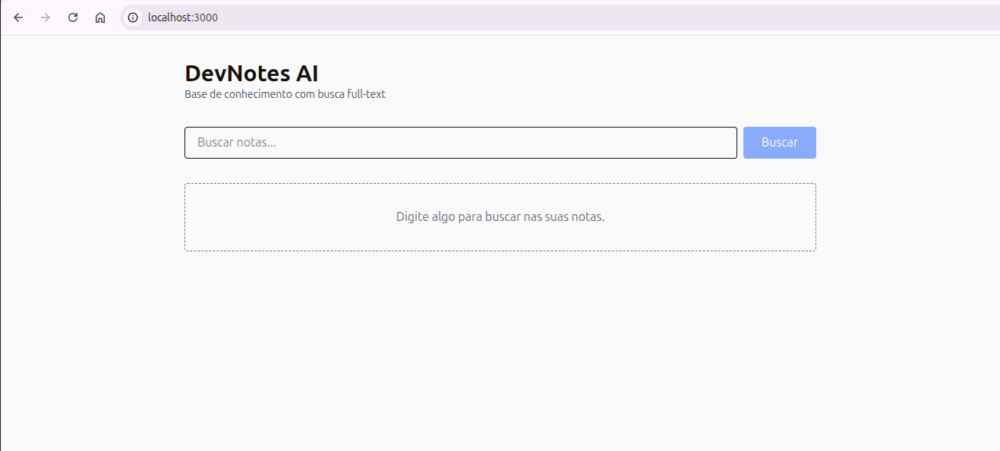
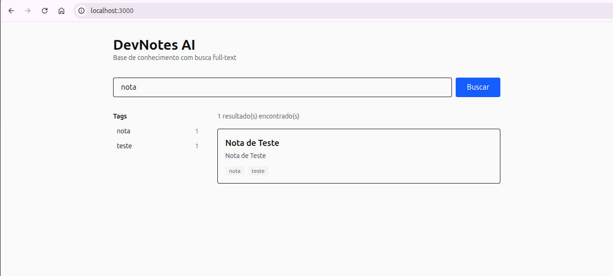
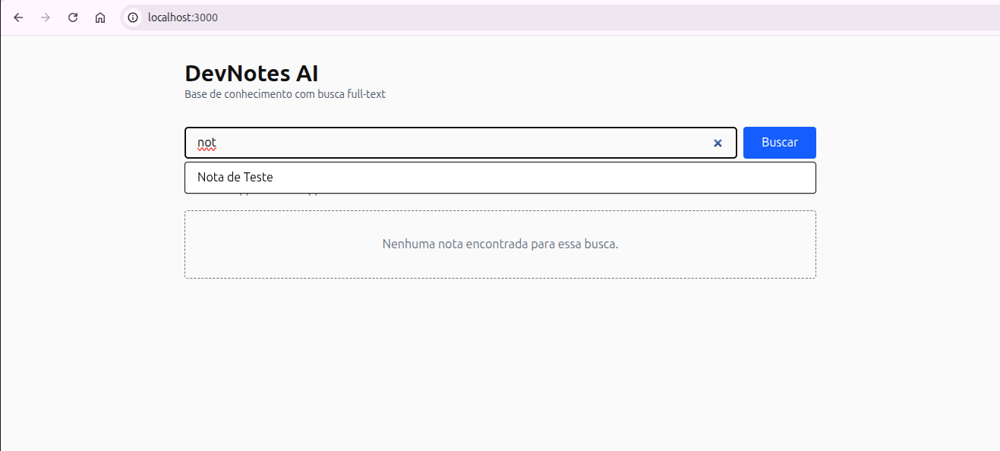
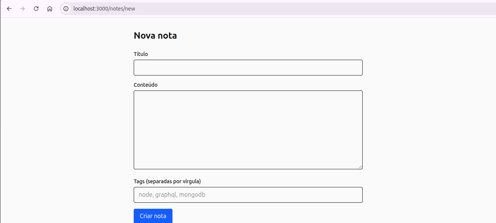
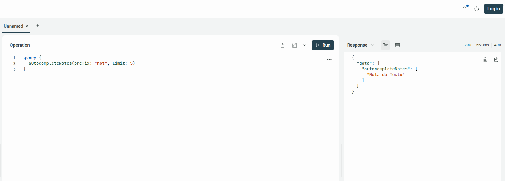
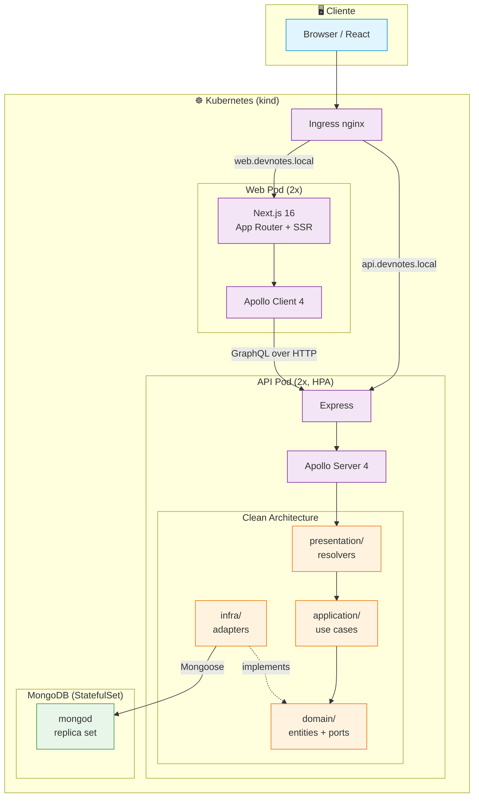
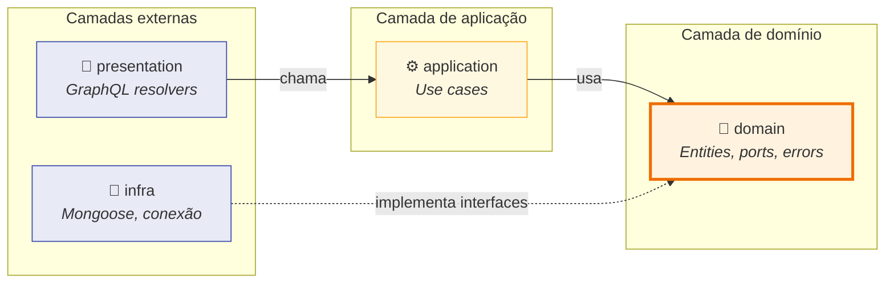
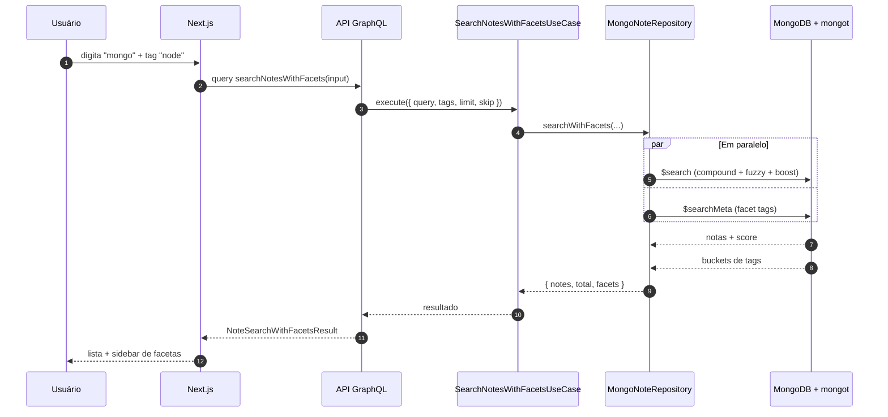

# DevNotes AI

[](https://github.com/alex-correa-dev/devnotes-ai/actions/workflows/ci.yml)

> Base de conhecimento pessoal com busca full-text nativa do MongoDB — construída como projeto de portfólio para demonstrar stack moderno full-stack.

## 🎯 Sobre

DevNotes AI é uma aplicação para salvar, organizar e buscar notas de estudo, snippets de código e aprendizados. Utiliza **MongoDB Full-Text Search** nativo (via `mongot`) para busca por relevância, facetas e autocomplete — sem depender de Elasticsearch ou outros motores externos.

O projeto cobre o ciclo completo de uma aplicação full-stack moderna: modelagem de domínio, API GraphQL, frontend SSR, containerização, orquestração em Kubernetes e CI/CD com publicação automática de imagens.

## 📸 Screenshots

### Home com busca



### Resultados com facetas por tag



### Autocomplete



### Criar nota



### API GraphQL



## 🛠️ Stack

| Camada | Tecnologia |
|---|---|
| **Banco** | MongoDB 8.2+ com `$search`, `$searchMeta` e facetas |
| **Backend** | Node.js 22 + Express + Apollo Server 4 + Mongoose |
| **Frontend** | React 19 + Next.js 16 (App Router) + Apollo Client 4 |
| **Monorepo** | Yarn 4 workspaces + Turborepo |
| **Containers** | Docker multi-stage + BuildKit cache |
| **Orquestração** | Kubernetes (kind) com Ingress, HPA e Secrets |
| **CI/CD** | GitHub Actions + GitHub Container Registry |
| **Qualidade** | TypeScript strict, ESLint 9 (flat config), Prettier, gitleaks |
| **Linguagem** | TypeScript (strict) |

## 🏗️ Arquitetura

### Visão geral



### Backend — Clean Architecture

O backend segue Clean Architecture com a regra de dependência apontando **para dentro**:



**Estrutura:**

```
apps/api/src/
├── domain/          # Entidades e regras de negócio (sem dependências externas)
│   ├── entities/
│   ├── errors/
│   └── repositories/    # Interfaces (portas)
├── application/     # Casos de uso (orquestração)
│   └── use-cases/
├── infra/           # Adaptadores (Mongoose, conexão)
│   ├── database/
│   └── repositories/    # Implementações das portas
└── presentation/    # GraphQL (resolvers, mappers, context)
    └── graphql/
```

O `infra` implementa interfaces do `domain` sem que as camadas internas saibam da existência do MongoDB, Express ou Apollo. Trocar MongoDB por outro banco significa criar um novo adaptador e ajustar uma linha no composition root.

### Fluxo da busca full-text



**Por que dois pipelines em paralelo:** `$search` e `$searchMeta` não podem coexistir no mesmo pipeline (ambos precisam ser o primeiro estágio). O repositório roda os dois em paralelo com `Promise.all` e junta os resultados.

### Monorepo

```
devnotes-ai/
├── apps/
│   ├── web/         # Next.js 16 + Apollo Client
│   └── api/         # Express + Apollo Server + Mongoose
├── packages/
│   ├── shared/      # Schema GraphQL (SDL) + tipos compartilhados
│   └── config/      # ESLint flat config, tsconfig base
├── infra/
│   └── k8s/         # Manifests Kubernetes + kind config
├── .github/
│   └── workflows/   # CI/CD pipeline
└── docker-compose.yml
```

## 🚀 Como rodar localmente

### Pré-requisitos

- Node.js 20+ (recomendado 22)
- Corepack (`corepack enable`)
- Docker + Docker Compose
- (Opcional) kind + kubectl para Kubernetes

### Desenvolvimento

```bash
# 1. Clonar
git clone git@github.com:alex-correa-dev/devnotes-ai.git
cd devnotes-ai

# 2. Instalar dependências
yarn install

# 3. Configurar variáveis de ambiente
cp .env.example .env
# Edite .env com seus valores

# 4. Subir MongoDB com Search (mongod + mongot)
docker compose up -d mongodb

# 5. Gerar tipos do GraphQL (primeira vez)
yarn workspace @devnotes/shared codegen
yarn workspace @devnotes/api codegen
yarn workspace @devnotes/web codegen

# 6. Rodar em modo desenvolvimento
yarn dev
```

- **API GraphQL:** http://localhost:4000/graphql
- **Frontend:** http://localhost:3000
- **Healthcheck da API:** http://localhost:4000/health

### Stack completa via Docker Compose

```bash
docker compose up -d --build
docker compose ps
```

Sobe MongoDB + API + Web em containers, com healthchecks encadeados (`mongodb` → `api` → `web`).

### Kubernetes (kind)

```bash
# Criar o cluster
kind create cluster --config infra/k8s/kind-config.yaml

# Instalar o nginx-ingress
kubectl apply -f https://raw.githubusercontent.com/kubernetes/ingress-nginx/main/deploy/static/provider/kind/deploy.yaml

# Instalar o MongoDB Community Operator via Helm
helm repo add mongodb https://mongodb.github.io/helm-charts
helm install community-operator mongodb/community-operator \
  --namespace mongodb-operator \
  --create-namespace \
  --set operator.watchNamespace="devnotes"

# Build, load e deploy
./infra/k8s/deploy.sh
```

Adicione ao `/etc/hosts`:

```
127.0.0.1 api.devnotes.local web.devnotes.local
```

Acesse `http://api.devnotes.local:8080/graphql` e `http://web.devnotes.local:8080`.

## 🧪 Testes

O projeto usa **Vitest** com cobertura de todas as camadas do backend e testes de componentes no frontend.

### Rodar os testes

```bash
# Todos os workspaces
yarn test

# Watch mode (durante desenvolvimento)
yarn workspace @devnotes/api test:watch
yarn workspace @devnotes/web test:watch
```

### Estrutura

```
apps/api/src/
├── domain/entities/note.spec.ts                    # Entidade + invariantes
├── application/use-cases/*.spec.ts                 # 5 use cases
├── infra/repositories/
│   ├── in-memory-note-repository.spec.ts           # Contrato
│   └── mongo-note-repository.spec.ts               # Integração (mongodb-memory-server)
└── presentation/graphql/mapper/note-mapper.spec.ts # Contrato GraphQL

apps/web/src/components/
├── note-card.spec.tsx                              # Renderização
└── note-list.spec.tsx                              # Estado vazio e lista
```

### Cobertura por camada

| Camada | O que é testado | Tipo |
|---|---|---|
| **Domain** | Invariantes da entidade `Note`, normalização de tags, `withId`, `withUpdatedFields` | Unitário |
| **Application** | Os 5 use cases com `InMemoryNoteRepository` | Unitário |
| **Infra (in-memory)** | Contrato do `NoteRepository` | Contrato |
| **Infra (Mongo)** | CRUD contra MongoDB real | Integração |
| **Presentation (API)** | Mapper do domínio para o contrato GraphQL | Unitário |
| **Presentation (Web)** | Renderização de `NoteCard` e `NoteList` | Componente |

### Por que o contrato importa

O `note-repository.contract.ts` define o comportamento que **qualquer** implementação de `NoteRepository` deve cumprir. Ele roda contra o `InMemoryNoteRepository` e o `MongoNoteRepository` — garantindo que os dois adaptadores se comportam igual do ponto de vista do domínio. Isso é o **Liskov Substitution Principle** em forma de teste.

### O que não é testado

- **Resolvers GraphQL** — finos, delegam para use cases. Testá-los seria testar o Apollo Server, não o código do projeto. Fica para testes E2E.
- **`$search`, `$searchMeta` e `$vectorSearch`** — exigem o sidecar `mongot`, que não roda no `mongodb-memory-server`. Cobertos por testes manuais no Sandbox e no ambiente Docker.

## 📦 Imagens publicadas

As imagens são publicadas automaticamente no GitHub Container Registry a cada push na `main`:

```
ghcr.io/alex-correa-dev/devnotes-api:latest
ghcr.io/alex-correa-dev/devnotes-web:latest
```

Tagueamento automático por branch (`main`), commit (`sha-<short>`) e `latest`.

## 📚 Roadmap

- [x] **Fase 0** — Setup do monorepo (Yarn 4 + Turborepo + TypeScript strict)
- [x] **Fase 1** — API GraphQL com Clean Architecture (CRUD em memória)
- [x] **Fase 2** — Persistência com MongoDB + Mongoose
- [x] **Fase 3** — Frontend Next.js + Apollo Client com SSR
- [x] **Fase 4** — Busca full-text com `$search` (fuzzy, boost, autocomplete)
- [x] **Fase 5** — Facetas com `$searchMeta` + paginação + ordenação por relevância
- [x] **Fase 6** — Dockerfiles multi-stage + compose completo
- [x] **Fase 7** — Kubernetes (kind) com Ingress, HPA e MongoDB Operator
- [x] **Fase 8** — CI/CD com GitHub Actions + publicação no GHCR

## 🎓 O que este projeto demonstra

- **Clean Architecture** aplicada de verdade: domínio isolado, casos de uso puros, adaptadores substituíveis
- **GraphQL** end-to-end com schema compartilhado no monorepo e Codegen tipado
- **Next.js App Router** com React Server Components + Client Components e SSR real
- **MongoDB Search nativo** (`$search`, `$searchMeta`, facetas) sem motores externos
- **Monorepo profissional** com Yarn 4, Turborepo, pacotes compartilhados e versionamento workspace
- **Containerização** com multi-stage builds, cache BuildKit, usuário non-root e healthchecks
- **Kubernetes** com Operator Pattern (MCK), Ingress, HPA e StatefulSet para banco
- **CI/CD** com lint, typecheck, build e publicação automática de imagens

## 🔒 Segurança

- Nunca commite arquivos `.env` — use `.env.example` como template
- `gitleaks` rodando como pre-commit hook
- Secret scanning e Push protection ativos no GitHub
- Variáveis sensíveis gerenciadas via Kubernetes Secrets
- Containers rodam como usuário não-root (`nodejs`, `nextjs`)

## 📄 Licença

MIT